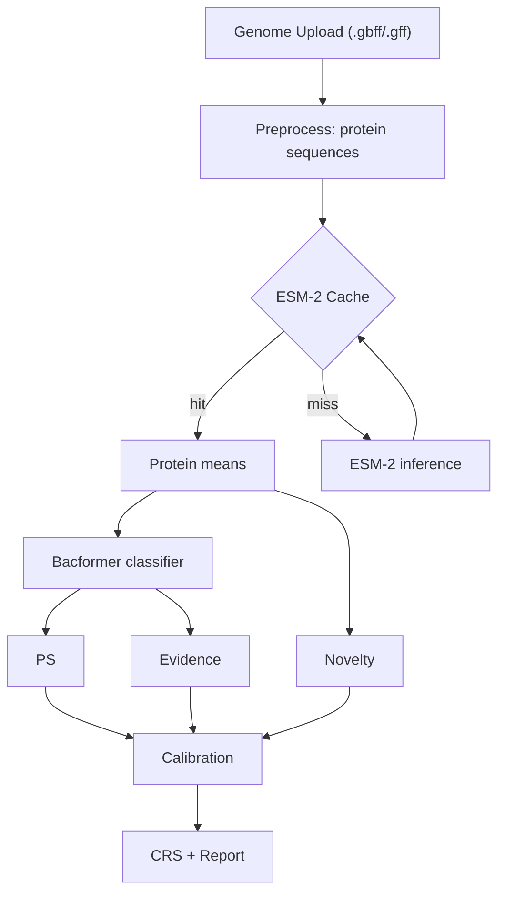

# FoodGuard AI

FoodGuard AI is a Bacformer-powered analysis system that assesses pathogen risk from bacterial genome assemblies. It ingests GenBank/GBFF files, computes protein embeddings with ESM‑2, applies a Bacformer classification head, and fuses multi‑modal signals to produce a calibrated risk score.

- Core scores: Pathogenicity Score (PS), Novelty Score (NS), Evidence Score (ES)
- Output: Combined Risk Score (CRS) with posture presets (precision/balanced/recall)
- Performance: Sub‑30s latency on cache hits with ≥90% hit rate (target)

---

## System Overview

### Purpose and Capabilities
- Detects likely foodborne pathogens from genome assemblies at upload time
- Produces human‑readable evidence and metrics for analyst review
- Supports large‑scale batch processing on HPC with sharded ESM‑2 caching
- Integrates with downstream calibration, retrieval, and reporting modules

### Architecture



- Preprocessing: `bacformer.pp.preprocess.preprocess_genome_assembly`
- Embeddings: `bacformer.pp.embed_prot_seqs.add_protein_embeddings`
- Cache wrappers: `foodguard/utils/cache.py`
- Pipeline orchestration: `foodguard/pipeline.py`

### Key Technologies
- Python, PyTorch, HuggingFace Transformers
- ESM‑2 protein language model (`facebook/esm2_t12_35M_UR50D`)
- Pandas, Datasets (HF), BioPython
- SLURM HPC for parallel cache population

---

## Manuscript & Validation Workflow

This repo also tracks the manuscript-ready analysis pipeline and reproducible validation runs.

- **Manuscript draft**: `foodguard/docs/manuscript_genome_embedding_analysis.md`
- **Robustness validation notebook**: `notebooks/foodguard_simulated_drift_study.ipynb`
  - Protein dropout, contig dropout, and contamination mixing stress tests (k=20).
- **HPC runner**: `scripts/submit_validation_notebook.sh`
- **Generated outputs**: `foodguard/analysis/robustness_validation_*` (CSV summaries + figure).

On Apolo‑3, submit the validation notebook with cache/manifest paths:
```bash
sbatch --partition=bigmem --cpus-per-task=2 --mem=0 \
  --export=ALL,MANIFEST=/path/to/gbff_manifest.tsv,CACHE_DIR=/path/to/.cache/esm2_h100,OUTPUT_DIR=/path/to/foodguard/analysis \
  scripts/submit_validation_notebook.sh
```

---

## Installation & Setup

### Requirements
- GPU: NVIDIA ≥16GB VRAM (A100/V100/T4 supported)
- Disk: 50–60 GB free for cache + model weights
- RAM: ≥32 GB recommended for preprocessing
- OS: Linux/macOS, Python 3.9+ (tested)

### Install

```bash
# clone
git clone https://github.com/jaygut/Bacformer.git
cd Bacformer

# environment
python3 -m venv venv
source venv/bin/activate
pip install -U pip wheel setuptools

# install Bacformer + dev extras
pip install -e .[dev]

# quick CUDA check
python -c "import torch; print(torch.cuda.is_available())"
```

### Configuration
- Pipeline config: `foodguard/config.py`
- Important fields:
  - `cache_dir`: directory with `prot_emb_*.pt` files
  - `cache_max_prot_seq_len`: must match cache (default `1024`)
  - `use_stub`: deterministic synthetic outputs for tests
  - `posture_id`: fusion preset for CRS

Environment variables (planned for API):
- `FOODGUARD_USE_STUB` (`true|false`) — default false
- `MODEL_PATH` — fine‑tuned classifier path
- `CACHE_DIR` — cache directory
- `POSTURE` — `precision_high|balanced|recall_high`

---

## Usage

### Pipeline (Python)

```python
from foodguard.pipeline import FoodGuardPipeline
from foodguard.config import PipelineConfig

config = PipelineConfig(cache_dir=".cache/esm2", cache_max_prot_seq_len=1024)
pipeline = FoodGuardPipeline(config=config)

# Analyze a GBFF file
result = pipeline.process_genome("/path/to/genome.gbff")
print(result["classification"], result["risk"])  # fields depend on model availability
```

Relevant implementation:
- Preprocess: `foodguard/pipeline.py:160-169`
- Cache lookup + embeddings: `foodguard/pipeline.py:211-241`
- Cache utilities: `foodguard/utils/cache.py:1-45`

### ESM‑2 Cache Population (HPC)

```bash
# GPU assessment
bash scripts/hpc_gpu_assessment.sh

# submit 8‑way sharded job array
sbatch scripts/submit_cache_population.sh

# monitor progress
python scripts/monitor_cache_progress.py --cache-dir /path/to/esm2_cache --expected 21657 --shards 8
```

Population script: `scripts/pilot_populate_esm2_cache.py:1-150`

### Smoke Test (cache behavior)

```bash
python scripts/esm2_smoke_cache.py
```

### Benchmark (latency + cache metrics)

```bash
python scripts/pilot_benchmark_pipeline.py \
  --manifest /path/to/gbff_manifest.tsv \
  --cache-dir .cache/esm2 \
  --limit 50
```

---

## API Specification (Planned)

A lightweight FastAPI adapter is planned to expose the pipeline. Until then, invoke the Python pipeline directly.

### Endpoints (design)
- `POST /analyze/genome` — multipart file upload (`.gbff/.gbff.gz/.gff/.gff.gz`)
- `POST /analyze/sequences` — JSON body with protein sequences
- `GET /health` — service health and model/cache status

### Request/Response

Request example:
```http
POST /analyze/genome
Content-Type: multipart/form-data
file=@genome.gbff
```

Response example:
```json
{
  "classification": {"ps": 0.94, "label": "pathogenic"},
  "novelty": {"ns": 0.22, "status": "beta"},
  "evidence": [{"protein_id": 123, "feature": "VFDB_match", "score": 0.88}],
  "risk": {"crs": 0.83, "posture": "recall_high"},
  "metadata": {"genome_id": "...", "species": "..."},
  "timing": {"total_sec": 24.7, "cache": {"hit": true, "lookup_sec": 1.2}}
}
```

Schema derives from the pipeline outputs and planned modules:
- Risk fusion: `foodguard/risk.py`
- Novelty baseline: `foodguard/novelty.py`

Authentication (planned):
- Header `Authorization: Bearer <JWT>` with role‑based access
- TLS in production; signed inputs and audit logs

Rate limiting & performance:
- Target 30s p95 latency on cache hits
- Enforce request size ≤50MB; queue long jobs

---

## Integration

- Batch processing: submit manifests to the cache populator, then call the pipeline over cached genomes
- Data ingestion: GBFF paths managed via manifest (`foodguard/docs/unified_manifest_blueprint.md`)
- Evidence sources: VFDB/CARD integration planned in `foodguard/evidence.py`
- Retrieval: FAISS library planned for `foodguard/retrieval.py`

Security practices:
- No secrets in code
- Validate file types; sanitize paths
- Audit logging on CRS computation

---

## Maintenance

### Backup & Recovery
- Cache backup: snapshot `prot_emb_*.pt` files; store hash list
- Logs: persist `logs/esm2_cache_*.out/err`; keep benchmark JSONL
- Models: version under `models/` and/or HuggingFace Hub

### Monitoring & Logging
- Use `scripts/monitor_cache_progress.py` for ETA and shard status
- Pipeline exposes recent cache metrics via `FoodGuardPipeline.last_cache_info` (`foodguard/pipeline.py:295-301`)

### Updates & Versioning
- Use SemVer for API adapter; stamp model, calibration, thresholds versions:
  - `calibration_version` and `thresholds_version` in `PipelineConfig` (`foodguard/config.py:1-31`)
- Document changes in `foodguard/docs/apolo_hpc_cache_report.md`

---

## Notebooks

Analysis notebooks are located in `/notebooks/`:

| Notebook | Purpose |
|----------|---------|
| `foodguard_manuscript_appendix.ipynb` | **Computational appendix** for the manuscript. Reproduces all figures and tables from pre-computed artifacts. Uses portable relative paths for reviewer distribution. |
| `foodguard_cache_embedding_analysis.ipynb` | Exploratory analysis of cached ESM-2 embeddings. Contains interactive visualizations and detailed investigation of embedding space geometry. |
| `foodguard_genome_statistics_visualization.ipynb` | Genome assembly statistics and quality control visualizations. |

### Running the Manuscript Appendix

The computational appendix loads pre-computed artifacts from `foodguard/analysis/` and requires no GPU:

```bash
cd notebooks/
jupyter notebook foodguard_manuscript_appendix.ipynb
```

All required artifacts (parquet files, CSVs, PNGs) are generated by scripts in `/scripts/` and stored in `foodguard/analysis/`.

---

## References

Key docs in `ai_docs/`:
- `Bacformer_MVP_Implementation_Guide_REVISED.md`
- `FoodGuard_Pilot_MVP_PRD.md`
- `Bacformer_MVP_Strategy_REVISED.md`
- `FoodGuard_Public_Data_Curation_Guide.md`

FoodGuard code references:
- Cache wrappers: `foodguard/utils/cache.py:1-45`
- Pipeline orchestration: `foodguard/pipeline.py`
- Novelty baseline: `foodguard/novelty.py`
- Risk fusion: `foodguard/risk.py`
- Manifest blueprint: `foodguard/docs/unified_manifest_blueprint.md`

Support & Contributions
- Issues and discussions: Bacformer repository tracker
- Contributions follow the main project’s guidelines in `README.md` at repo root
